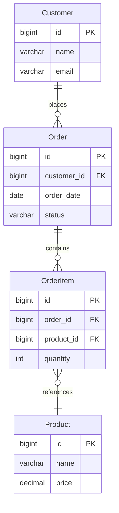

# DDD Aggregate Relationship Generation Implementation Plan

> **For agentic workers:** REQUIRED SUB-SKILL: Use superpowers:subagent-driven-development (recommended) or superpowers:executing-plans to implement this plan task-by-task. Steps use checkbox (`- [ ]`) syntax for tracking.

**Goal:** Parse Mermaid ER diagram relationship cardinality (OneToMany, ManyToOne, etc.), propagate structured relationship data through the pipeline, and generate Spring Boot entities with proper JPA relationship annotations, aggregate-root-aware controllers with nested GET endpoints, and response DTOs that include related entities.

**Architecture:** The pipeline has three stages: (1) Mermaid parsing extracts entities + relationships into a structured `RelationshipInfo[]`, (2) the AI prompt + OpenAPI integrity check are enhanced to produce `$ref`-based schemas with proper nesting, (3) `springBootGenerator.ts` consumes the structured relationships to emit `@ManyToOne`/`@OneToMany` JPA annotations, nested controller endpoints, and response DTOs with child collections. The aggregate root is the entity with only outgoing `OneToMany` relationships and no incoming `ManyToOne` FK fields within a domain.

**Tech Stack:** TypeScript (VS Code extension), Handlebars templates, OpenAPI 3.0.3 YAML, Spring Boot 3.4 / JPA / Hibernate

---

## File Map

| File | Action | Responsibility |
|------|--------|----------------|
| `src/commands/generateDomainDrivenAPIs.ts` | Modify | Add `RelationshipInfo` interface, parse cardinality from Mermaid, populate `DomainInfo.relationships`, identify aggregate roots, enhance OpenAPI integrity validation |
| `src/services/aiService.ts` | Modify | Enhance `generateOpenAPISpec` system prompt to mandate `$ref` for FK fields and `items.$ref` for OneToMany collections |
| `src/services/springBootGenerator.ts` | Modify | Accept relationships, classify fields as relationship vs primitive, generate JPA annotations, nested controller endpoints, cascade rules |
| `templates/springboot/Entity.java.template` | Modify | Add conditional blocks for `@ManyToOne`/`@OneToMany`/`@JoinColumn` annotations |
| `templates/springboot/Controller.java.template` | Modify | Add nested GET endpoint block for aggregate root's children |
| `templates/springboot/Service.java.template` | Modify | Add `findByParentId` method for child entity lookup |
| `templates/springboot/Repository.java.template` | Modify | Add `findBy{Parent}Id` query method declaration |
| `templates/springboot/ResponseDto.java.template` | Modify | Add optional child collection fields for aggregate root responses |

---

### Task 1: Define RelationshipInfo Interface and Parse Mermaid Cardinality

**Files:**
- Modify: `src/commands/generateDomainDrivenAPIs.ts:11-17` (interfaces)
- Modify: `src/commands/generateDomainDrivenAPIs.ts:1188-1196` (relationship parsing)

- [ ] **Step 1: Add RelationshipInfo interface and update DomainInfo**

In `src/commands/generateDomainDrivenAPIs.ts`, after the existing `DomainInfo` interface (line 17), add:

```typescript
interface RelationshipInfo {
    /** The entity that holds the FK (the "many" side or the owning side) */
    sourceEntity: string;
    /** The entity being referenced (the "one" side or the inverse side) */
    targetEntity: string;
    /** 'OneToMany' | 'ManyToOne' | 'OneToOne' | 'ManyToMany' */
    type: 'OneToMany' | 'ManyToOne' | 'OneToOne' | 'ManyToMany';
    /** The Mermaid label (e.g., "has", "belongs to") */
    label: string;
}
```

Update `DomainInfo` to include relationships:

```typescript
interface DomainInfo {
    name: string;
    erdImagePath?: string;
    mermaidData?: string;
    csvData?: string;
    entities: string[];
    relationships: RelationshipInfo[];
}
```

- [ ] **Step 2: Replace the relationship regex with cardinality-aware parsing**

Replace the block at lines 1189-1196 with a new parser that captures cardinality tokens. The Mermaid ER diagram cardinality notation is:

| Token | Meaning |
|-------|---------|
| `\|\|` | exactly one |
| `o\|` | zero or one |
| `\|{` or `}|` | one or more (used in `||--o{` patterns) |
| `o{` or `}o` | zero or more |

The relationship line format is: `EntityA <left-card>--<right-card> EntityB : "label"`

Common patterns:
- `Customer ||--o{ Order` → Customer has zero-or-more Orders → Customer OneToMany Order, Order ManyToOne Customer
- `Order }o--|| Product` → Order has exactly-one Product → Order ManyToOne Product
- `User ||--|| Profile` → one-to-one

Replace lines 1189-1196 in `generateDomainDrivenAPIs.ts`:

```typescript
        // Parse relationship lines with cardinality: "EntityA <left>--<right> EntityB : label"
        // Captures: entity names, left cardinality markers, right cardinality markers, and label
        const relPattern = /^\s*(\w+)\s+([\|o\{}\<\>]+)--([\|o\{}\<\>]+)\s+(\w+)\s*:\s*"?([^"\n]*)"?/gm;
        const relationships: RelationshipInfo[] = [];

        while ((match = relPattern.exec(mermaidContent)) !== null) {
            const leftEntity = match[1];
            const leftCard = match[2];   // cardinality on left entity's side
            const rightCard = match[3];  // cardinality on right entity's side
            const rightEntity = match[4];
            const label = match[5]?.trim() || '';

            if (leftEntity === 'erDiagram') { continue; }
            if (rightEntity === 'erDiagram') { continue; }

            mermaidEntitySet.add(leftEntity);
            mermaidEntitySet.add(rightEntity);

            const relType = classifyRelationship(leftCard, rightCard);

            if (relType === 'OneToMany') {
                // leftEntity is the "one" side, rightEntity is the "many" side
                relationships.push({
                    sourceEntity: rightEntity,  // FK holder (many side)
                    targetEntity: leftEntity,   // referenced entity (one side)
                    type: 'ManyToOne',
                    label
                });
                relationships.push({
                    sourceEntity: leftEntity,   // inverse side
                    targetEntity: rightEntity,  // collection of children
                    type: 'OneToMany',
                    label
                });
            } else if (relType === 'ManyToOne') {
                // leftEntity is the "many" side, rightEntity is the "one" side
                relationships.push({
                    sourceEntity: leftEntity,
                    targetEntity: rightEntity,
                    type: 'ManyToOne',
                    label
                });
                relationships.push({
                    sourceEntity: rightEntity,
                    targetEntity: leftEntity,
                    type: 'OneToMany',
                    label
                });
            } else if (relType === 'OneToOne') {
                relationships.push({
                    sourceEntity: leftEntity,
                    targetEntity: rightEntity,
                    type: 'OneToOne',
                    label
                });
            } else if (relType === 'ManyToMany') {
                relationships.push({
                    sourceEntity: leftEntity,
                    targetEntity: rightEntity,
                    type: 'ManyToMany',
                    label
                });
            }
        }
```

- [ ] **Step 3: Add the classifyRelationship helper function**

Add this function before the `discoverDomains` function (around line 1100):

```typescript
/**
 * Classify a Mermaid ER relationship based on cardinality markers.
 *
 * Mermaid ER cardinality tokens:
 *   || = exactly one,  o| or |o = zero or one
 *   }| or |{ = one or more,  }o or o{ = zero or more
 *
 * @param leftCard  cardinality markers on the left entity's side
 * @param rightCard cardinality markers on the right entity's side
 * @returns relationship type from left entity's perspective
 */
function classifyRelationship(leftCard: string, rightCard: string): 'OneToMany' | 'ManyToOne' | 'OneToOne' | 'ManyToMany' {
    const isMany = (card: string): boolean => /[\{\}]/.test(card);  // { or } means "many"
    const leftIsMany = isMany(leftCard);
    const rightIsMany = isMany(rightCard);

    if (!leftIsMany && !rightIsMany) {
        return 'OneToOne';
    }
    if (!leftIsMany && rightIsMany) {
        // left is "one", right is "many" → left has OneToMany
        return 'OneToMany';
    }
    if (leftIsMany && !rightIsMany) {
        // left is "many", right is "one" → left has ManyToOne
        return 'ManyToOne';
    }
    return 'ManyToMany';
}
```

- [ ] **Step 4: Wire relationships into DomainInfo and identify aggregate roots**

Update the domain creation code (around lines 1198-1213) to include relationships and identify the aggregate root. The aggregate root is the entity that has only `OneToMany` relationships outward and no `ManyToOne` relationships (i.e., it is never a FK holder pointing to another entity within the same domain):

```typescript
        const mermaidEntities = Array.from(mermaidEntitySet).sort();

        // Identify aggregate root: entity with no ManyToOne relationships to other entities in this domain
        const manyToOneSources = new Set(
            relationships
                .filter(r => r.type === 'ManyToOne')
                .map(r => r.sourceEntity)
        );
        const aggregateRoot = mermaidEntities.find(e => !manyToOneSources.has(e)) || mermaidEntities[0];

        if (domains.has(domainName)) {
            const existing = domains.get(domainName)!;
            existing.mermaidData = mermaidContent;
            existing.relationships = relationships;
            existing.aggregateRoot = aggregateRoot;
            if (existing.entities.length === 0 && mermaidEntities.length > 0) {
                existing.entities = mermaidEntities;
            }
        } else {
            domains.set(domainName, {
                name: domainName,
                mermaidData: mermaidContent,
                entities: mermaidEntities,
                relationships: relationships,
                aggregateRoot: aggregateRoot
            });
        }
        logger.info(`Loaded Mermaid ERD for ${domainName}: ${mermaidEntities.length} entities, ${relationships.length} relationships, aggregate root: ${aggregateRoot}`);
```

Also update `DomainInfo` to include `aggregateRoot`:

```typescript
interface DomainInfo {
    name: string;
    erdImagePath?: string;
    mermaidData?: string;
    csvData?: string;
    entities: string[];
    relationships: RelationshipInfo[];
    aggregateRoot?: string;
}
```

- [ ] **Step 5: Update all existing DomainInfo construction sites to include `relationships: []`**

Search for all places in `generateDomainDrivenAPIs.ts` where `DomainInfo` objects are created (there are several: PNG discovery ~line 1150, CSV discovery, etc.) and add `relationships: []` to each. For example, the PNG domain creation around line 1153:

```typescript
            domains.set(domainName, {
                name: domainName,
                erdImagePath: path.join(folderPath, pngFile),
                entities: [],
                relationships: []
            });
```

- [ ] **Step 6: Verify the build compiles**

Run: `npm run compile` (or the project's build command)
Expected: No TypeScript errors

- [ ] **Step 7: Commit**

```bash
git add src/commands/generateDomainDrivenAPIs.ts
git commit -m "feat: parse Mermaid ER cardinality into structured RelationshipInfo"
```

---

### Task 2: Inject Relationship Context into AI OpenAPI Generation Prompt

**Files:**
- Modify: `src/commands/generateDomainDrivenAPIs.ts:660-678` (fullContext assembly)
- Modify: `src/services/aiService.ts:693-717` (OpenAPI generation prompt)

- [ ] **Step 1: Add structured relationship summary to the domain context**

In `generateDomainDrivenAPIs.ts`, inside the `fullContext` assembly block (around line 677, after the Mermaid ERD instructions), add a relationship summary section that will be included in the AI prompt:

```typescript
// After line 677, before the closing backtick of the mermaid section
${domain.relationships.length > 0 ? `
8. RELATIONSHIP MAPPING INSTRUCTIONS — The following relationships were parsed from the Mermaid ERD:
${domain.relationships.map(r => `   - ${r.sourceEntity} ${r.type} ${r.targetEntity} (${r.label})`).join('\n')}

   For each ManyToOne relationship:
   - The source entity schema MUST include a $ref field pointing to the target entity schema (e.g., customer: { $ref: '#/components/schemas/Customer' })
   - The source entity schema MUST also include the FK field as integer/int64 with description noting the referenced entity

   For each OneToMany relationship:
   - The source entity schema MUST include an array field with items.$ref pointing to the child entity (e.g., orders: { type: array, items: { $ref: '#/components/schemas/Order' } })

   For the aggregate root (${domain.aggregateRoot || domain.entities[0]}):
   - The GET by ID response SHOULD include all related child entities inline
   - Add nested endpoints: GET /api/v1/{root-name}/{id}/{child-name} to retrieve children by parent ID
` : ''}
```

- [ ] **Step 2: Enhance the aiService.ts OpenAPI system prompt**

In `src/services/aiService.ts`, add to the system prompt (around line 617, after the "Best Practices" section):

```typescript
**Entity Relationship Handling:**
- For ManyToOne relationships: the child schema MUST include a \`$ref\` property pointing to the parent schema AND a separate FK integer field (e.g., customer_id: integer/int64)
- For OneToMany relationships: the parent schema MUST include an array property with items.\`$ref\` to the child schema
- Aggregate root GET by ID response should include nested child entities
- Generate nested collection endpoints: GET /api/v1/{parent-resource}/{parentId}/{child-resource}
- FK fields MUST have description: "Foreign key referencing {ParentEntity}.id"
```

- [ ] **Step 3: Verify the build compiles**

Run: `npm run compile`
Expected: No TypeScript errors

- [ ] **Step 4: Commit**

```bash
git add src/commands/generateDomainDrivenAPIs.ts src/services/aiService.ts
git commit -m "feat: inject relationship context into OpenAPI generation prompt"
```

---

### Task 3: Enhance OpenAPI Integrity Validation for Relationships

**Files:**
- Modify: `src/commands/generateDomainDrivenAPIs.ts:100-188` (validation functions)

- [ ] **Step 1: Add relationship validation to OpenAPIIntegrityResult**

Update the interface and validation function:

```typescript
interface OpenAPIIntegrityResult {
    missingSchemas: string[];
    missingResources: string[];
    missingRelationshipFields: string[];
}
```

- [ ] **Step 2: Add relationship field checking in validateOpenAPIIntegrity**

After the existing entity validation loop (line 185), add relationship validation:

```typescript
function validateOpenAPIIntegrity(
    openApiSpec: any,
    entities: string[],
    relationships: RelationshipInfo[] = []
): OpenAPIIntegrityResult {
    const schemas = openApiSpec?.components?.schemas || {};
    const schemaNames = new Set(Object.keys(schemas).map(name => name.toLowerCase()));
    const resources = extractOpenAPIResources(openApiSpec?.paths || {});

    const missingSchemas: string[] = [];
    const missingResources: string[] = [];
    const missingRelationshipFields: string[] = [];

    entities.forEach(entity => {
        const entityLower = entity.toLowerCase();
        if (!schemaNames.has(entityLower)) {
            missingSchemas.push(entity);
        }

        const singularResource = toKebabCase(entity);
        const pluralResource = toPluralKebabCase(singularResource);
        const hasResource = Array.from(resources).some(resource => {
            const resourcePascal = toPascalCase(resource);
            const singularPascal = toPascalCase(toSingular(resource));
            return resource === singularResource
                || resource === pluralResource
                || resourcePascal === entity
                || singularPascal === entity;
        });

        if (!hasResource) {
            missingResources.push(entity);
        }
    });

    // Validate relationship fields exist in schemas
    for (const rel of relationships) {
        if (rel.type === 'ManyToOne') {
            // Check that the source entity schema has a FK field or $ref to target
            const sourceSchemaKey = Object.keys(schemas).find(
                k => k.toLowerCase() === rel.sourceEntity.toLowerCase()
            );
            if (sourceSchemaKey) {
                const sourceProps = schemas[sourceSchemaKey]?.properties || {};
                const targetLower = rel.targetEntity.toLowerCase();
                const hasFkField = Object.entries(sourceProps).some(([name, prop]: [string, any]) => {
                    const nameL = name.toLowerCase();
                    return nameL.includes(targetLower + '_id')
                        || nameL.includes(targetLower + 'id')
                        || prop?.$ref?.toLowerCase()?.includes(targetLower);
                });
                if (!hasFkField) {
                    missingRelationshipFields.push(
                        `${rel.sourceEntity} missing FK/ref to ${rel.targetEntity}`
                    );
                }
            }
        }
    }

    return { missingSchemas, missingResources, missingRelationshipFields };
}
```

- [ ] **Step 3: Update callers of validateOpenAPIIntegrity to pass relationships**

Find all calls to `validateOpenAPIIntegrity` in the file and add the `relationships` parameter. The main call site is around line 770:

```typescript
const integrityResult = validateOpenAPIIntegrity(parsedSpec, domain.entities, domain.relationships);
```

Also update the log messages to include `missingRelationshipFields`:

```typescript
if (integrityResult.missingRelationshipFields.length > 0) {
    logger.warn(`Missing relationship fields: ${integrityResult.missingRelationshipFields.join(', ')}`);
}
```

- [ ] **Step 4: Verify the build compiles**

Run: `npm run compile`
Expected: No TypeScript errors

- [ ] **Step 5: Commit**

```bash
git add src/commands/generateDomainDrivenAPIs.ts
git commit -m "feat: validate relationship FK fields in OpenAPI integrity check"
```

---

### Task 4: Update Entity.java.template for JPA Relationship Annotations

**Files:**
- Modify: `templates/springboot/Entity.java.template`

- [ ] **Step 1: Add relationship annotation blocks to the Entity template**

Replace the fields loop (lines 71-89) with relationship-aware rendering:

```handlebars
    {{#each fields}}
    {{#if isManyToOne}}
    /**
     * Many-to-one relationship: this {{../entityName}} belongs to a {{relatedEntity}}.
     * Loaded lazily to avoid N+1 query issues.
     */
    @ManyToOne(fetch = FetchType.LAZY)
    @JoinColumn(name = "{{columnName}}", nullable = {{#if required}}false{{else}}true{{/if}})
    private {{relatedEntity}} {{name}};
    {{else if isOneToMany}}
    /**
     * One-to-many relationship: this {{../entityName}} has many {{relatedEntity}} children.
     * Cascade PERSIST and MERGE so children are saved with the parent.
     * orphanRemoval ensures children removed from the collection are deleted.
     */
    @OneToMany(mappedBy = "{{mappedBy}}", cascade = {CascadeType.PERSIST, CascadeType.MERGE}, orphanRemoval = true, fetch = FetchType.LAZY)
    private List<{{relatedEntity}}> {{name}} = new java.util.ArrayList<>();
    {{else}}
    /**
     * {{name}} field for {{../entityName}}.
     {{#if description}}
     * {{description}}
     {{/if}}
     {{#if isMap}}
     * Note: Map types are stored as JSON in the database.
     * Requires @JdbcTypeCode for proper Hibernate 6+ handling.
     {{/if}}
     * TODO: Add @Column annotation with appropriate constraints
     * Example: @Column(name = "{{name}}", length = 255, nullable = false)
     */
    {{#if isMap}}
    @org.hibernate.annotations.JdbcTypeCode(org.hibernate.type.SqlTypes.JSON)
    @Column(columnDefinition = "TEXT")
    {{/if}}
    private {{{type}}} {{name}};
    {{/if}}
    {{/each}}
```

- [ ] **Step 2: Commit**

```bash
git add templates/springboot/Entity.java.template
git commit -m "feat: add JPA relationship annotation support to Entity template"
```

---

### Task 5: Update ResponseDto.java.template for Child Collections

**Files:**
- Modify: `templates/springboot/ResponseDto.java.template`

- [ ] **Step 1: Add child collection fields for aggregate root responses**

After the regular fields loop (line 66), add an optional block for child collections:

```handlebars
    {{#each childCollections}}
    /**
     * Related {{entityName}} entities (loaded via $expand or nested endpoint).
     */
    @Schema(description = "Collection of related {{entityName}} entities")
    @JsonInclude(JsonInclude.Include.NON_EMPTY)
    private List<{{dtoType}}> {{fieldName}};
    {{/each}}
```

This requires the `childCollections` array to be passed from `springBootGenerator.ts` when generating the aggregate root's response DTO. Each entry has `{ entityName, dtoType, fieldName }`.

- [ ] **Step 2: Commit**

```bash
git add templates/springboot/ResponseDto.java.template
git commit -m "feat: add child collection fields to ResponseDto template"
```

---

### Task 6: Update Repository.java.template for Parent Lookup Methods

**Files:**
- Modify: `templates/springboot/Repository.java.template`

- [ ] **Step 1: Read the current Repository template**

Read the existing template to understand its structure before modifying.

- [ ] **Step 2: Add findByParentId query methods**

Add a conditional block that generates `findBy{Parent}Id` methods when the entity has ManyToOne relationships:

```handlebars
    {{#each parentRelationships}}
    /**
     * Find all {{../entityName}} entities belonging to a specific {{parentEntity}}.
     *
     * @param {{parentFieldName}}Id the ID of the parent {{parentEntity}}
     * @return list of {{../entityName}} entities for the given parent
     */
    List<{{../entityName}}> findBy{{parentFieldName}}Id(Long {{camelCase parentFieldName}}Id);

    /**
     * Find all {{../entityName}} entities belonging to a specific {{parentEntity}} with pagination.
     *
     * @param {{parentFieldName}}Id the ID of the parent {{parentEntity}}
     * @param pageable pagination parameters
     * @return page of {{../entityName}} entities for the given parent
     */
    Page<{{../entityName}}> findBy{{parentFieldName}}Id(Long {{camelCase parentFieldName}}Id, Pageable pageable);
    {{/each}}
```

The `parentRelationships` context variable will be an array of `{ parentEntity: "Customer", parentFieldName: "Customer" }` — populated by `springBootGenerator.ts`.

- [ ] **Step 3: Commit**

```bash
git add templates/springboot/Repository.java.template
git commit -m "feat: add findByParentId query methods to Repository template"
```

---

### Task 7: Update Service.java.template for Parent Lookup

**Files:**
- Modify: `templates/springboot/Service.java.template`

- [ ] **Step 1: Add findByParentId service methods**

Add after the `delete` method (line 231):

```handlebars
    {{#each parentRelationships}}
    /**
     * Retrieves {{../resourceName}} belonging to a specific {{parentEntity}}.
     *
     * @param {{camelCase parentFieldName}}Id the ID of the parent {{parentEntity}}
     * @return list of {{../resourceName}} for the given parent
     */
    @Transactional(readOnly = true)
    public List<{{../entityName}}Response> findBy{{parentFieldName}}Id(Long {{camelCase parentFieldName}}Id) {
        Assert.notNull({{camelCase parentFieldName}}Id, "Parent ID must not be null");
        log.debug("Fetching {{../resourceName}} by {{parentFieldName}} id: {}", {{camelCase parentFieldName}}Id);
        return {{camelCase ../repositoryName}}.findBy{{parentFieldName}}Id({{camelCase parentFieldName}}Id)
                .stream()
                .map(mapper::toResponse)
                .collect(Collectors.toList());
    }
    {{/each}}
```

- [ ] **Step 2: Commit**

```bash
git add templates/springboot/Service.java.template
git commit -m "feat: add findByParentId service methods for child entity lookup"
```

---

### Task 8: Update Controller.java.template for Nested Endpoints

**Files:**
- Modify: `templates/springboot/Controller.java.template`

- [ ] **Step 1: Add nested GET endpoint for aggregate root children**

Add after the `delete` method (before the closing brace of the class). This block only renders when the controller is for an aggregate root that has child entities:

```handlebars
    {{#each childEndpoints}}
    /**
     * Retrieves {{childResourceName}} belonging to this {{../entityName}}.
     * Nested endpoint: GET /{{../resourceName}}/{id}/{{childResourceName}}
     *
     * @param id the ID of the parent {{../entityName}}
     * @return list of {{childEntityName}} entities belonging to the parent
     */
    @GetMapping("/{id}/{{childResourceName}}")
    @Operation(
        summary = "Get {{childResourceName}} for a specific {{../entityName}}",
        description = "Retrieve all {{childResourceName}} belonging to {{../entityName}} with the given ID"
    )
    @ApiResponses(value = {
        @ApiResponse(
            responseCode = "200",
            description = "Successfully retrieved {{childResourceName}}"
        ),
        @ApiResponse(responseCode = "404", description = "{{../entityName}} not found")
    })
    public ResponseEntity<?> get{{childEntityName}}ByParentId(
            @RequestHeader(value = "X-B3-Trace-Id", required = false) String traceId,
            @PathVariable Long id) {
        log.debug("GET /{{../resourceName}}/{}/{{childResourceName}}", id);
        // Verify parent exists
        if ({{camelCase ../serviceName}}.getById(id).isEmpty()) {
            return ResponseEntity.notFound().build();
        }
        // Delegate to child service
        var children = {{camelCase childServiceName}}.findBy{{../entityName}}Id(id);
        HttpHeaders headers = buildResponseHeaders(traceId);
        return ResponseEntity.ok().headers(headers).body(children);
    }
    {{/each}}
```

This requires `childEndpoints` context data: `{ childResourceName, childEntityName, childServiceName }`.

- [ ] **Step 2: Add child service injection to the controller**

Update the controller constructor and fields to include child services. Add another conditional block at the top of the class for additional injected services:

```handlebars
    {{#each childEndpoints}}
    private final {{childServiceName}} {{camelCase childServiceName}};
    {{/each}}
```

And update the constructor parameters and assignments accordingly.

- [ ] **Step 3: Commit**

```bash
git add templates/springboot/Controller.java.template
git commit -m "feat: add nested child collection endpoints to Controller template"
```

---

### Task 9: Update SpringBootGenerator to Populate Relationship Template Data

**Files:**
- Modify: `src/services/springBootGenerator.ts:292-323` (generateControllersFromOpenAPI)
- Modify: `src/services/springBootGenerator.ts:855-899` (convertOpenAPISchemaToFields)
- Modify: `src/services/springBootGenerator.ts:110-190` (generateProject)

This is the largest task. The generator must:
1. Accept relationships data alongside schemas
2. Classify which fields are FK references vs plain data
3. Pass `isManyToOne`, `isOneToMany`, `relatedEntity`, `mappedBy`, `columnName` to entity templates
4. Pass `parentRelationships` to repository and service templates
5. Pass `childEndpoints` and `childCollections` to controller and response DTO templates

- [ ] **Step 1: Add relationships parameter to generateProject and generateControllersFromOpenAPI**

Update `generateProject` signature (line 110):

```typescript
    async generateProject(
        config: SpringBootProjectConfig,
        openApiEndpoints: OpenAPIEndpoint[],
        schemas: Record<string, any> = {},
        relationships: RelationshipInfo[] = []
    ): Promise<void> {
```

Pass relationships down to `generateControllersFromOpenAPI` (line 138):

```typescript
const resources = await this.generateControllersFromOpenAPI(
    projectPath, config, openApiEndpoints, schemas, relationships
);
```

Update `generateControllersFromOpenAPI` signature (line 292):

```typescript
    private async generateControllersFromOpenAPI(
        projectPath: string,
        config: SpringBootProjectConfig,
        endpoints: OpenAPIEndpoint[],
        schemas: Record<string, any>,
        relationships: RelationshipInfo[] = []
    ): Promise<string[]> {
```

- [ ] **Step 2: Build relationship lookup maps in generateControllersFromOpenAPI**

At the start of the method, create lookup structures:

```typescript
        // Build relationship lookups per entity
        const entityRelationships: Record<string, {
            manyToOne: RelationshipInfo[];
            oneToMany: RelationshipInfo[];
        }> = {};

        for (const rel of relationships) {
            const source = this.toPascalCase(rel.sourceEntity);
            if (!entityRelationships[source]) {
                entityRelationships[source] = { manyToOne: [], oneToMany: [] };
            }
            if (rel.type === 'ManyToOne') {
                entityRelationships[source].manyToOne.push(rel);
            } else if (rel.type === 'OneToMany') {
                entityRelationships[source].oneToMany.push(rel);
            }
        }
```

- [ ] **Step 3: Pass relationship data to generateModelClasses**

Update `generateModelClasses` to accept and use relationship data. The entity template context needs enriched field data:

```typescript
        for (const [resource, resourceEndpointsList] of Object.entries(resourceEndpoints)) {
            const entityName = this.toPascalCase(resource);
            const rels = entityRelationships[entityName] || { manyToOne: [], oneToMany: [] };

            await this.generateController(projectPath, config, resource, resourceEndpointsList, rels);
            await this.generateService(projectPath, config, resource, rels);
            await this.generateRepository(projectPath, config, resource, rels);
            await this.generateMapper(projectPath, config, resource);

            const resourceSchema = this.findSchemaForResource(resource, schemas);
            await this.generateModelClasses(projectPath, config, resource, resourceSchema, rels);
        }
```

- [ ] **Step 4: Enhance convertOpenAPISchemaToFields to flag relationship fields**

Add relationship data enrichment after `convertOpenAPISchemaToFields` in `generateModelClasses`. When a field's type matches a known entity name and there's a matching `ManyToOne` relationship, set `isManyToOne: true`. When there's a `OneToMany` relationship, add a synthetic field for the collection:

```typescript
    private enrichFieldsWithRelationships(
        fields: any[],
        entityName: string,
        rels: { manyToOne: RelationshipInfo[]; oneToMany: RelationshipInfo[] }
    ): any[] {
        const enriched = fields.map(field => {
            // Check if this field is a FK reference field (e.g., customerId -> ManyToOne Customer)
            const matchingManyToOne = rels.manyToOne.find(r => {
                const targetLower = r.targetEntity.toLowerCase();
                const fieldLower = field.name.toLowerCase();
                return fieldLower === targetLower + '_id'
                    || fieldLower === targetLower + 'id'
                    || fieldLower === targetLower;
            });

            if (matchingManyToOne) {
                return {
                    ...field,
                    isManyToOne: true,
                    relatedEntity: this.toPascalCase(matchingManyToOne.targetEntity),
                    columnName: field.name.includes('_') ? field.name : this.toSnakeCase(field.name) + '_id',
                    name: this.toCamelCase(matchingManyToOne.targetEntity),
                    type: this.toPascalCase(matchingManyToOne.targetEntity)
                };
            }
            return field;
        });

        // Add OneToMany collection fields
        for (const oneToMany of rels.oneToMany) {
            const childEntity = this.toPascalCase(oneToMany.targetEntity);
            const fieldName = this.toCamelCase(oneToMany.targetEntity) + 's';  // e.g., "orders"
            
            // Don't add if already present
            if (!enriched.some(f => f.name === fieldName)) {
                enriched.push({
                    name: fieldName,
                    type: `List<${childEntity}>`,
                    isOneToMany: true,
                    relatedEntity: childEntity,
                    mappedBy: this.toCamelCase(entityName),  // the field name on the child side
                    required: false,
                    isString: false
                });
            }
        }

        return enriched;
    }
```

- [ ] **Step 5: Wire enrichFieldsWithRelationships into generateModelClasses**

In the `generateModelClasses` method, after converting fields from OpenAPI schema, call the enrichment:

```typescript
        // After: const fields = this.convertOpenAPISchemaToFields(schema);
        const enrichedFields = this.enrichFieldsWithRelationships(fields, entityName, rels);
        // Use enrichedFields instead of fields for Entity template
```

For the request/response DTOs, continue using the original `fields` (without relationship annotations), but for the aggregate root response DTO, add `childCollections`:

```typescript
        const childCollections = rels.oneToMany.map(r => ({
            entityName: this.toPascalCase(r.targetEntity),
            dtoType: this.toPascalCase(r.targetEntity) + 'Response',
            fieldName: this.toCamelCase(r.targetEntity) + 's'
        }));
```

- [ ] **Step 6: Pass parentRelationships to repository and service template contexts**

When generating repository and service, pass `parentRelationships`:

```typescript
        const parentRelationships = rels.manyToOne.map(r => ({
            parentEntity: this.toPascalCase(r.targetEntity),
            parentFieldName: this.toPascalCase(r.targetEntity)
        }));

        // Pass to repository template context:
        { ...existingContext, parentRelationships }

        // Pass to service template context:
        { ...existingContext, parentRelationships }
```

- [ ] **Step 7: Pass childEndpoints to controller template context**

When generating the controller for an entity that has `OneToMany` relationships (aggregate root):

```typescript
        const childEndpoints = rels.oneToMany.map(r => ({
            childResourceName: this.toKebabCase(r.targetEntity) + 's',
            childEntityName: this.toPascalCase(r.targetEntity),
            childServiceName: this.toPascalCase(r.targetEntity) + 'Service'
        }));

        // Pass to controller template context:
        { ...existingContext, childEndpoints }
```

- [ ] **Step 8: Add toSnakeCase helper method to SpringBootGenerator**

```typescript
    private toSnakeCase(value: string): string {
        return value
            .replace(/([a-z0-9])([A-Z])/g, '$1_$2')
            .replace(/[- ]+/g, '_')
            .toLowerCase();
    }
```

- [ ] **Step 9: Verify the build compiles**

Run: `npm run compile`
Expected: No TypeScript errors

- [ ] **Step 10: Commit**

```bash
git add src/services/springBootGenerator.ts
git commit -m "feat: populate relationship template data in SpringBootGenerator"
```

---

### Task 10: Update Callers to Pass Relationships Through the Pipeline

**Files:**
- Modify: `src/commands/generateDomainDrivenAPIs.ts` (where springBootGenerator.generateProject is called)
- Modify: `src/commands/generateSpringBootProject.ts` (standalone path)
- Modify: `src/commands/implementJiraStory.ts` (Jira-driven path)

- [ ] **Step 1: Find all callsites of springBootGenerator.generateProject**

Search for `.generateProject(` in the codebase and add the `relationships` parameter.

In `generateDomainDrivenAPIs.ts`, the call is around where Spring Boot generation happens after OpenAPI is generated. Pass `domain.relationships`:

```typescript
await generator.generateProject(config, endpoints, schemas, domain.relationships);
```

- [ ] **Step 2: For standalone paths (generateSpringBootProject.ts, implementJiraStory.ts), pass empty array**

These paths don't have Mermaid data, so pass `[]`:

```typescript
await generator.generateProject(config, endpoints, schemas, []);
```

- [ ] **Step 3: Verify the build compiles**

Run: `npm run compile`
Expected: No TypeScript errors

- [ ] **Step 4: Commit**

```bash
git add src/commands/generateDomainDrivenAPIs.ts src/commands/generateSpringBootProject.ts src/commands/implementJiraStory.ts
git commit -m "feat: wire relationships through all Spring Boot generation paths"
```

---

### Task 11: Integration Testing with Sample Mermaid ERD

**Files:**
- No code changes — manual verification

- [ ] **Step 1: Create a test Mermaid file with relationships**

Create a file `test-domain.mmd` with:



- [ ] **Step 2: Run the generate domain-driven APIs command and verify:**

Expected generated output:

1. **Customer entity** has:
   - `@OneToMany(mappedBy = "customer", cascade = {CascadeType.PERSIST, CascadeType.MERGE})` for `List<Order> orders`
   - No `@ManyToOne` (it is the aggregate root)

2. **Order entity** has:
   - `@ManyToOne(fetch = FetchType.LAZY)` + `@JoinColumn(name = "customer_id")` for `Customer customer`
   - `@OneToMany(mappedBy = "order")` for `List<OrderItem> orderItems`

3. **OrderItem entity** has:
   - `@ManyToOne(fetch = FetchType.LAZY)` + `@JoinColumn(name = "order_id")` for `Order order`
   - `@ManyToOne(fetch = FetchType.LAZY)` + `@JoinColumn(name = "product_id")` for `Product product`

4. **CustomerController** has:
   - `GET /customers/{id}/orders` nested endpoint

5. **CustomerResponse** DTO has:
   - `List<OrderResponse> orders` field

6. **OrderRepository** has:
   - `findByCustomerId(Long customerId)` method

7. **OrderService** has:
   - `findByCustomerId(Long customerId)` method

- [ ] **Step 3: Verify generated code compiles**

Navigate to the generated Spring Boot project and run:

```bash
mvn compile
```

Expected: BUILD SUCCESS with no compilation errors.

---

## Summary of Changes

| Gap | Fix |
|-----|-----|
| Mermaid cardinality discarded | Task 1: Parse `||--o{` tokens into structured `RelationshipInfo[]` |
| No relationship data structure | Task 1: Add `RelationshipInfo` interface and `DomainInfo.relationships` |
| No aggregate root identification | Task 1: Identify root entity from relationship graph |
| AI prompt doesn't mandate `$ref` for FKs | Task 2: Enhanced prompt with explicit relationship instructions |
| Integrity check ignores relationships | Task 3: Validate FK fields exist in schemas |
| Entity template has no JPA annotations | Task 4: `@ManyToOne`/`@OneToMany`/`@JoinColumn` in template |
| Response DTO has no child collections | Task 5: Add `childCollections` block |
| Repository has no parent lookup | Task 6: `findByParentId` methods |
| Service has no parent lookup | Task 7: `findByParentId` service methods |
| Controller has no nested endpoints | Task 8: `GET /{id}/{children}` endpoints |
| Generator doesn't pass relationship data | Task 9: Enrich fields, build template context |
| Callers don't pass relationships | Task 10: Wire through all generation paths |
